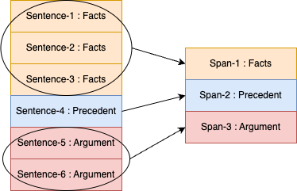
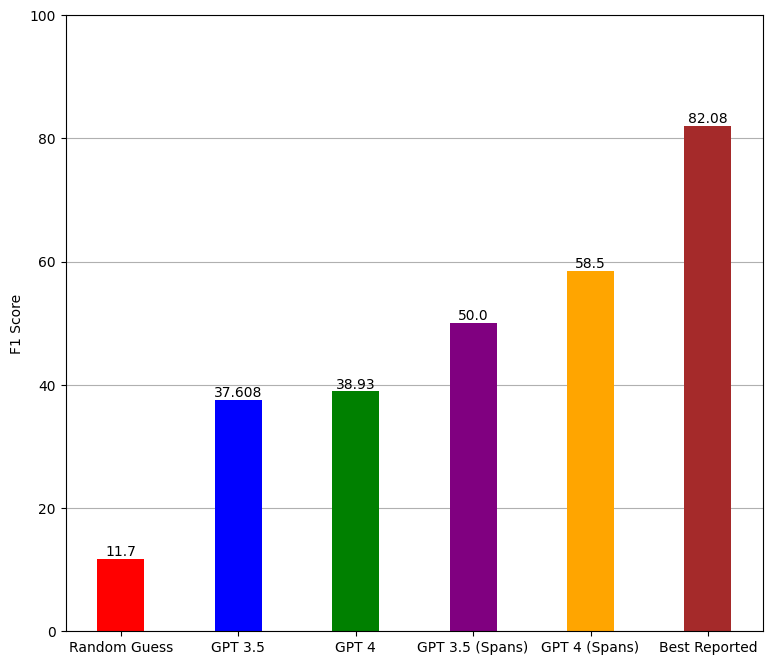

# Zero-Shot-Evaluation-on-GPT-on-Semantic-Segmentation-of-Indian-Legal-Documents

# Experiment

## Dataset

For our experiment, we have used a corpus of Indian legal judgments curated by [Paheli](#references). The authors scraped Supreme Court case documents from [West Law Asia](https://www.westlawasia.com/india) from the following domains:

- Criminal
- Land and property
- Constitutional
- Labour and Industrial
- Intellectual Property Rights

The corpus consists of a total of 50 curated legal documents from the Indian Supreme Court of Justice, which have been annotated by legal experts. The documents were annotated with the following set of labels:

**L = {Facts, Ruling by Lower Court, Argument, Statute, Precedent, Ratio of the decision, Ruling by Present Court}**

The authors also performed several experiments on the data and several trained models. Their best-performing model is a Hierarchical Bi-LSTM model with a Conditional Random Field (CRF) head, which obtained an F1 score of **82.08%**. In their experiment, the authors performed a 5-fold cross-validation such that 40 documents were chosen for training and 10 were chosen for evaluation. Comparison with their best-performing model is shown in the next section.

## Setup

We perform zero-shot classification of the Supreme Court documents using two different experiments, sentence level and span level. We further perform each experiment with two different available GPT models 'gpt-3.5-turbo' and 'gpt-4-turbo' ([source](https://platform.openai.com/docs/models)). The model specifications are briefly presented in Table 1.

| **Model**         | **Context Length** | **Training Data** | **Cost** |
|-------------------|--------------------|-------------------|----------|
| `gpt-3.5-turbo`   | 16k                | Sep 2021          | \$0.5    |
| `gpt-4-turbo`     | 128k               | Dec 2023          | \$10     |

*Table 1: Comparison of different GPT models.*

## Sentence Level Classification

We first randomly chose 20% of the documents, i.e., 10 out of 50 documents for the zero-shot evaluation process. For each legal document, we extracted the sentences and used OpenAI's Chat Completion API to generate label predictions for each sentence. An example prompt for the sentence-level zero-shot classification is as follows:

---

**"Given a sentence of Indian Legal Court Case document, classify it into one of the following labels: {Facts, Ruling by Lower Court, Argument, Statute, Precedent, Ratio of the decision, Ruling by Present Court}. Make sure the output is strictly in the same format as the given set of labels without any extra words or artifacts. Sentence: **

*"This appeal is directed against the final judgment and order dated 03.10.2007 passed by the High Court of Judicature, Andhra Pradesh at Hyderabad in Criminal Appeal No.436 of 2001 whereby the High Court dismissed the appeal filed by the appellant herein and confirmed the judgment dated 19.03.2001 passed by the Special Judge, C.B.I.Cases, Visakhapatnam in C.C.No.2 of 1998."*

---

We used both `gpt-3.5-turbo` and `gpt-4-turbo` for the experiment. We stored the generated label and investigated the model output. We observed that the model generated several label predictions that were not in the intended format, i.e., with leading or trailing blank spaces or unintended punctuation marks. Furthermore, we observed hallucinations, i.e., generated labels that were not in the intended set of labels, a subset of which is shown in Table 2. The hallucinations were completely prevented with the aid of proper prompting. Adding the sentence: **"Make sure the output is strictly in the same format as the given set of labels without any extra words or artifacts."** in the prompt removed almost all of the hallucinations.

| **Expected Format** | **Generated Output**           |
|---------------------|--------------------------------|
| "Facts"             | "{Facts}"                      |
| "Argument"          | " Argument."                   |
| "Precedent"         | "Label:{Precedent}"            |
| "Facts"             | "<Random Sentence> Label: Facts"|
| "Ratio of decision" | "Ratio of deal"                |

*Table 2: A sample of outputs generated with unwanted artifacts*

Furthermore, it corrected most of the generated labels with excess punctuation marks and whitespace. We utilized regular expressions to clean the unintended symbols and whitespace from the generated labels and then calculated the F1 score.

## Span Level Classification

We observed that there are abnormal line breaks present in the corpus. For example, three contiguous lines we observed in a case document are:

- "In Teri Oat Estates (P"
- "Ltd.v"
- "UT, Chandigarh (2004) 2 SCC 130 2003 Indlaw SC 1504"

They were annotated with the same label (Precedent) by the legal experts who annotated the documents. These lines individually do not make much sense, especially the first two parts. However, when combined together, it is obvious that it is a precedent case of a private limited company vs Chandigarh union territory. As expected, the first two of these lines were misclassified by the GPT models in our first experiment. We observed many more instances of such line breaks.

As a result, we conducted a second experiment where we restructured the data used in the first experiment by combining contiguous data items (lines) with the same label into one single data item by performing string concatenation and then assigning the new row with the source label as shown in Figure 1. This caused broken sentence snippets and one or more complete sentences to be concatenated and annotated as a single data item with the same label.

*Figure 1: Schematic example of restructuring the Supreme Court case documents.*

We believed that doing so should give the models more context and in turn increase its performance. We modified the prompt slightly so that the model expects a snippet of text as opposed to a sentence in our previous experiment and sent the spans of lines with the input prompt. We then cleaned the generated span labels and calculated the F1 scores for both models.

# Results and Discussion

In Figure 2, we illustrated the F1 score results of random probabilistic guessing, zero-shot performance of `gpt-3.5-turbo` and `gpt-4-turbo` on sentence and span level predictions, and the best performing model of [Paheli](#references) as bar plots. Random guessing based on probability gives an F1 score of **11.7%**, which is not surprising. GPT-3.5 obtained about **37.6%** macro F1 score, outperforming random guessing by a good margin. GPT-4 gained a very tiny performance boost over its predecessor by scoring a **38.93%** F1 score. Both GPT models took a leap in performance for the span-level experiments with **50%** and **58.5%** F1 scores for GPT-3.5 and GPT-4, respectively.

*Figure 2: F1 scores of random guess, zero-shot prediction with GPT-3.5 and 4 over two different experimental setups, and the best-reported model by [Paheli](#references).*

We observe a significant gain in performance from sentence-level prediction to span-level predictions. We believe this is due to the fact that the documents are originally structured in a manner where there are a lot of lines that are incomplete sentences. The GPT models failed to make sense out of such incomplete sentences and, as expected, misclassified them. Furthermore, concatenation of contiguous lines with the same label served two purposes: firstly, joined broken sentence parts and secondly, in many instances, it concatenated multiple full sentences together. This increase in input size gave the models more contextual information, and the increase in performance is a testament to that.

Regardless of the performance gain, it is still not enough to consider either of the GPT models competitive when it comes to semantic segmentation of legal documents of the Indian legal system in a zero-shot setting. As we can see, they do not stand a chance against the BiLSTM-CRF model provided by the author, which scored an F1 of **82.08%**. A smaller language model that has been fine-tuned for the task performs much better than LLMs in a zero-shot setting for the classification task in consideration. Therefore, we do not recommend using Chat GPT and its variants instead of models specifically fine-tuned for the task.

# Conclusion

The goal of this work was to evaluate whether the Chat-GPT model can classify sentences in Indian legal documents out of the box. We performed zero-shot evaluation on semantic segmentation tasks of Indian legal documents using both GPT-3.5 and GPT-4 models. We performed the evaluation task at sentence level and span level. In sentence level, the F1 scores were **37.6%** and **38.9%** respectively for GPT-3.5 and GPT-4. We noticed a performance jump in the span level experiment where the F1 scores were **50%** and **58.5%** respectively. However, the performance of the GPT models is not good enough to call them reliable in terms of semantic segmentation of legal documents in a zero-shot setting. We believe that if the GPT model is pre-trained on legal documents, it should definitely improve upon the performance and may be able to compete with the current state of the art.

# Limitations

A limiting factor of our work is the lack of extensive prompt engineering. We mentioned previously in the [Sentence Level Classification](#sentence-level-classification) section that modifying the prompt nullified hallucinations and unwanted output artifacts to a great degree. Extensive prompt engineering may possibly improve the model predictions to a certain degree. However, we doubt the gain would be major. Furthermore, in this experiment, we did not try out different sampling temperature values. We used the baseline sampling temperature value to emulate Chat-GPT in its default state. However, one can try different sampling temperature values and then compare the differences in performance metrics.
